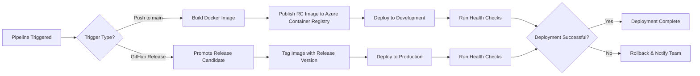

```mermaid
flowchart LR
    A[Pipeline Triggered] --> B{Trigger Type?}

    B -->|Push to main| C[Build Docker Image]
    B -->|GitHub Release| D[Promote Release Candidate]

    C --> E[Publish RC Image to Azure Container Registry]
    D --> F[Tag Image with Release Version]

    E --> G[Deploy to Development]
    F --> H[Deploy to Production]

    G --> I[Run Health Checks]
    H --> J[Run Health Checks]

    I --> K{Deployment Successful?}
    J --> K

    K -->|Yes| L[Deployment Complete]
    K -->|No| M[Rollback & Notify Team]
```