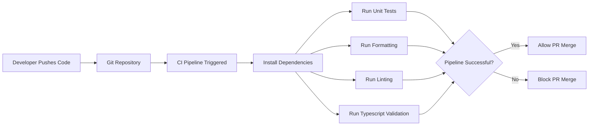

# CI

```mermaid
flowchart LR
    A[Developer Pushes Code] --> B[Git Repository]
    B --> C[CI Pipeline Triggered]
    C --> D[Install Dependencies]
    D --> E1[Run Unit Tests]
    D --> E2[Run Formatting]
    D --> E3[Run Linting]
    D --> E4[Run Typescript Validation]
    E1--> G{Pipeline Successful?}
    E2--> G
    E3--> G
    E4--> G
    G -->|Yes| H[Allow PR Merge]
    G -->|No| I[Block PR Merge]
```
