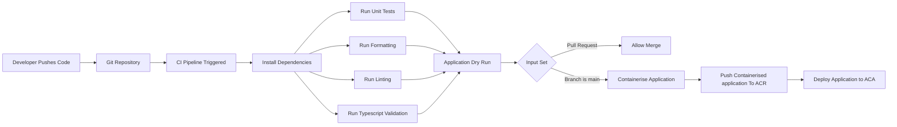

# CI

```mermaid
flowchart LR
    A[Developer Pushes Code] --> B[Git Repository]
    B --> C[CI Pipeline Triggered]
    C --> D[Install Dependencies]
    D --> E1[Run Unit Tests]
    D --> E2[Run Formatting]
    D --> E3[Run Linting]
    D --> E4[Run Typescript Validation]
    E1--> G[Application Dry Run]
    E2--> G
    E3--> G
    E4--> G
    G-->H{Input Set}
    H -->|Pull Request| I[Allow Merge]
    H -->|Branch is main| J[Containerise Application]
    J --> K[Push Containerised application To ACR]
    K-->L[Deploy Application to ACA]
    
```
