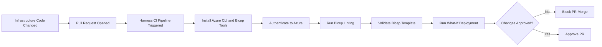
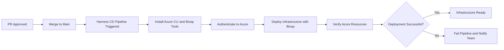

# Infra

## CI

```mermaid

flowchart LR
    A[Infrastructure Code Changed] --> B[Pull Request Opened]
    B --> C[Harness CI Pipeline Triggered]
    C --> D[Install Azure CLI and Bicep Tools]
    D --> E[Authenticate to Azure]
    E --> F[Run Bicep Linting]
    F --> G[Validate Bicep Template]
    G --> H[Run What-If Deployment]
    H --> I{Changes Approved?}

    I -->|No| J[Block PR Merge]
    I -->|Yes| K[Approve PR]
```

## CD

```mermaid
flowchart LR
    A[PR Approved] --> B[Merge to Main]
    B --> C[Harness CD Pipeline Triggered]
    C --> D[Install Azure CLI and Bicep Tools]
    D --> E[Authenticate to Azure]
    E --> F[Deploy Infrastructure with Bicep]
    F --> G[Verify Azure Resources]
    G --> H{Deployment Successful?}

    H -->|Yes| I[Infrastructure Ready]
    H -->|No| J[Fail Pipeline and Notify Team]
```
