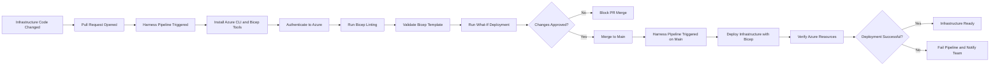

# Infra

```mermaid

flowchart LR
    A[Infrastructure Code Changed] --> B[Pull Request Opened]
    B --> C[Harness Pipeline Triggered]
    C --> D[Install Azure CLI and Bicep Tools]
    D --> E[Authenticate to Azure]
    E --> F[Run Bicep Linting]
    F --> G[Validate Bicep Template]
    G --> H[Run What-If Deployment]
    H --> I{Changes Approved?}

    I -->|No| J[Block PR Merge]
    I -->|Yes| K[Merge to Main]

    K --> L[Harness Pipeline Triggered on Main]
    L --> M[Deploy Infrastructure with Bicep]
    M --> N[Verify Azure Resources]
    N --> O{Deployment Successful?}

    O -->|Yes| P[Infrastructure Ready]
    O -->|No| Q[Fail Pipeline and Notify Team]

```